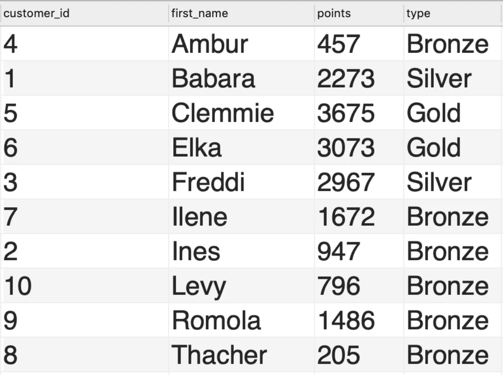

# Code With Mosh: Complete SQL Mastery

## Retrieving Data from a Single Table

### The `SELECT` statement

#### Using a database

Use the `USE` keyword to select a database to perform queries against.

```sql
USE sql_store;
```

#### Selecting data

Use the `SELECT` keyword to select data from a table.

```sql
SELECT *
FROM customers;

SELECT customer_id, first_name
FROM customers;
```

#### Filter data

Use the `WHERE` keyword to filter data.

```sql
SELECT customer_id, first_name
FROM customers
WHERE customer_id = 1;
```

#### Sort result on a given column

Use the `ORDER BY` keyword to sort results on a given column.

```sql
SELECT customer_id, first_name
FROM customers
ORDER BY first_name;
```

#### Comment out segments

Use `--` to comment out queries.

```sql
SELECT customer_id, first_name
FROM customers
-- ORDER BY first_name;
```

### The `SELECT` Clause

#### Arithmetic operations

It is possible to perform arithmetic operations on data.

```sql
SELECT last_name, first_name, points, points + 10
FROM customers

SELECT last_name,
       first_name,
       points,
       (points * 10) + 100
FROM customers;
```

This will print out each customer's `points`, and then their `points + 10`.

#### Aliases

We can give the new column an alias using the `AS` keyword.

```sql
SELECT last_name,
       first_name,
       points,
       (points + 10) * 100 AS discount_factor
FROM customers;
```

#### Remove duplicates

We can remove duplicates using the `DISTINCT` keyword.

```sql
SELECT DISTINCT state
FROM customers;
```

### The `WHERE` Clause

#### Used as a conditional

The `WHERE` statement is used as a conditional when iterating over records.

```sql
SELECT *
FROM customers
WHERE points > 3000;

SELECT *
FROM customers
WHERE state = 'VA';
```

All ordinary comparison operator are included.

#### Filter on dates

We can use the **standard notation for dates** when filtering for dates.

```sql
SELECT *
FROM customers
WHERE birth_date > '1990-01-01';
```

### The `AND`, `OR` and `NOT` operators

We can combine multiple search conditions when filtering data.

```sql
-- Both conditions must be true
SELECT *
FROM customers
WHERE birth_date > '1990-01-01'
  AND points > 1000;

-- One condition must be true
SELECT *
FROM customers
WHERE birth_date > '1990-01-01'
  OR points > 1000;

-- Conditionals can be chained together
SELECT *
FROM customers
WHERE birth_date > '1990-01-01'
   OR (points > 1000 AND state = 'VA');
```

Note that `AND` has a higher precedence than `OR` by default. We can override
this precedence using parenthesis `()`.

```sql
-- Conditionals can be negated
SELECT *
FROM customers
WHERE (NOT birth_date > '1990-01-01')
   OR (points > 1000 AND state = 'VA');
```

### The `IN` operator

Let's say we want to query all customers in Virginia or Florida or Georgia. We
**can** write the query like this:

```sql
SELECT *
FROM customers
WHERE state = 'VA'
   OR state = 'FL'
   OR state = 'GA';
```

However, there is a more efficient way to query this data.

```sql
SELECT *
FROM customers
WHERE state IN ('VA', 'FL', 'GA');
```

We can also negate this conditional.

```sql
SELECT *
FROM customers
WHERE state NOT IN ('VA', 'FL', 'GA');

SELECT *
FROM products
WHERE quantity_in_stock IN (49, 38, 72)
```

### The `BETWEEN` operator

We **can** write a comparison within an interval like this:

```sql
SELECT *
FROM customers
WHERE points >= 1000
  AND points <= 3000;
```

However, there is a syntactically nicer way to query this data:

```sql
SELECT *
FROM customers
WHERE points BETWEEN 1000 AND 3000;

SELECT *
FROM customers
WHERE birth_date BETWEEN '1990-01-01' AND '2000-01-01';
```

This is exactly equivalent to the ordinary comparison above. This values in
`BETWEEN` are inclusive.

### The `LIKE` operator

We can retrieve records that match a given string pattern.

```sql
SELECT *
FROM customers
-- b% - records where last name starts with b, and any character after b
WHERE last_name LIKE 'b%';

SELECT *
FROM customers
-- %b% - records where last name has a b anywhere
WHERE last_name LIKE '%b%';

SELECT *
FROM customers
-- _____y - records where last name has exactly,
-- 6 characters, and where y is the last character
WHERE last_name LIKE '_____y';

SELECT *
FROM customers
WHERE last_name LIKE 'b____y';
```

The `LIKE` operator is an old operator. We now rather use `REGEXP` to search
using regular expressions.

### The `REGEXP` operator

Regular expressions are a powerful tool for string manipulation.

```sql
-- Query customers with 'field' in their last name
SELECT *
FROM customers
WHERE last_name REGEXP 'field';
```

`^` represents the beginning of a string. `$` represents the end of a string.

The pipe operator (`|`) represents a logical `OR`, or multiple search patterns.

```sql
SELECT *
FROM customers
WHERE last_name REGEXP 'field|mac';
```

We can chain these operators.

```sql
-- Last name starts with 'field', or contains 'mac'
SELECT *
FROM customers
WHERE last_name REGEXP '^field|mac';

-- Any last name that contains 'ge', 'ie' or 'me'
SELECT *
FROM customers
WHERE last_name REGEXP '[gim]e';

-- Any last name that contains 'any character from a to p', followed by an 'e'
SELECT *
FROM customers
WHERE last_name REGEXP '[a-p]e';
```

#### Some exercises to get familiar with regular expressions

```sql
-- First names are ELKA or AMBUR
SELECT *
FROM customers
WHERE first_name REGEXP 'elka|ambur';

-- Last names end with EY or ON
SELECT *
FROM customers
WHERE last_name REGEXP 'ey$|on$';

-- Last names start with MY or contains SE
SELECT *
FROM customers
WHERE last_name REGEXP '^my|se';

-- Last names contain B followed by R or U
SELECT *
FROM customers
WHERE last_name REGEXP 'b[ru]';
```

### The `IS NULL` operator

The `IS NULL` operator can be used when a record is missing an attribute.

`NULL` in a record means the absence of an attribute (a column).

```sql
SELECT *
FROM customers
WHERE phone IS NULL;

-- This can be chained with other logical operators, such as NOT
SELECT *
FROM customers
WHERE phone IS NOT NULL;
```

### The `ORDER BY` clause

We can use `ORDER BY` to sort data.

By default, the **primary key** is used when ordering data.

```sql
-- Sort by first name in alphabetical order
SELECT *
FROM customers
ORDER BY first_name;

-- Sort by first name in reverse alphabetical order
SELECT *
FROM customers
ORDER BY first_name DESC;
```

We can also sort by multiple columns.

```sql
-- First sort by state in alphabetical order.
-- If multiple customers are from the same state,
-- then sort on their first name in alphabetical order.
SELECT *
FROM customers
ORDER BY state, first_name

-- Sort by total price in descending order, based on an alias
SELECT *, (quantity * unit_price) AS total_price
FROM order_items
WHERE order_id = 2
ORDER BY total_price DESC;
```

### The `LIMIT` clause

We can use the `LIMIT` clause to limit the amount of data returned from a query.

```sql
-- Return the first 3 customers
SELECT *
FROM customers
LIMIT 3;
```

If the value provided to `LIMIT` is greater than the number of records in the
table, the entire table will be returned. Let's say we have 10 records in the
`customers` table.

```sql
-- Returns the total number of customers, i.e. all 10 records
SELECT *
FROM customers
LIMIT 300;
```

We can add an offset to the limit. This is very useful when we want to
**paginate** the data returned from a query.

```sql
-- Page 1: 1-3
-- Page 2: 4-6
-- Page 3: 7-9
-- Return page 3 by skipping the first 6 records, and then pick 3 records.
SELECT *
FROM customers
LIMIT 6,3;
```

#### A small exercise

```sql
-- Get top 3 customers, based on amount of points
SELECT *
FROM customers
ORDER BY points DESC
LIMIT 3
```

## Retrieving data from multiple tables

### The `INNER JOIN` statement

We can join multiple tables together using the `JOIN` keyword. For now, we only
use `INNER JOIN`, but throughout the course, other type of `JOIN`'s will be
used.

```sql
-- Join the orders and customers table where customer_id in orders equals
-- customer_id in customers.
-- Note that we can give customers an alias 'c'.
SELECT order_id, first_name, last_name
FROM orders
         INNER JOIN customers c ON orders.customer_id = c.customer_id
```

In situations where we have **the same column in multiple tables**, we need to
specify the column.

```sql
-- Here, we specify c.customer_id in order to prevent it being ambiguous
SELECT order_id, c.customer_id, first_name, last_name
FROM orders
         INNER JOIN customers c ON orders.customer_id = c.customer_id
```

These table names are getting quite long. We can abbreviate them using the first
letter like so:

```sql
-- Note that if both tables have the same first letter,
-- we simply use common sense to abbreviate them.
SELECT order_id, c.customer_id, first_name, last_name
FROM orders o
         INNER JOIN customers c ON o.customer_id = c.customer_id
```

### Joining across databases

In the real world, we often need to work with several databases.

In the example below, `sql_inventory.products` is a table from a different
database than the database `order_items` resides in.

```sql
SELECT *
FROM order_items oi
         INNER JOIN sql_inventory.products p ON oi.product_id = p.product_id
```

Note that the prefix before the table name depends on which database we `USE`.

```sql
-- Note that we explicitly use 'sql_inventory' database.
-- This changes how the syntax of getting 'order_items' in 'sql_store'.
USE sql_inventory;

SELECT *
FROM sql_store.order_items oi
         INNER JOIN products p ON p.product_id = oi.product_id
```

### Self joins

In SQL, we can join a table with itself.

As an example, we have employees with a given `employee_id`. An employee also
reports to a given employee in the `reports_to` column, using an `employee_id`.
In this case, we can **self join** the table to query desired data.

```sql
-- m is shorthand for 'manager'
SELECT e.first_name,
       e.last_name,
       m.first_name AS manager_first_name,
       m.last_name  AS manager_last_name
FROM employees e
         INNER JOIN employees m ON e.reports_to = m.employee_id
```

### Joining multiple tables

We can join **more than 2 tables** when writing a query.

As an example, we want to create a report for the status on our customers'
orders.

```sql
SELECT order_id,
       order_date,
       first_name,
       last_name,
       os.name AS status
FROM orders o
         INNER JOIN customers c on o.customer_id = c.customer_id
         INNER JOIN order_statuses os on o.status = os.order_status_id
```

We just joined 3 tables! In the real word, you may need to join 10+ tables.

Another example: We want to create a report for payments executed by client,
with their payment method.

```sql
SELECT p.date,
       p.invoice_id,
       p.amount,
       c.name  AS client_name,
       pm.name AS payment_method
FROM payments p
         INNER JOIN clients c on p.client_id = c.client_id
         INNER JOIN payment_methods pm on p.payment_method = pm.payment_method_id
```

### Compound join conditions

A table may have a **composite primary key**. A composite primary key contains
more than one column.


If a table has a composite primary key, we need to be aware when we're joining
this table with other tables.

```sql
SELECT *
FROM order_items oi
         JOIN order_item_notes oin
              ON oi.order_id = oin.order_Id
                  AND oi.product_id = oin.product_id
```

### Implicit `JOIN` syntax

We have the following basic `JOIN` query:

```sql
SELECT *
FROM orders o
         JOIN customers c on o.customer_id = c.customer_id
```

We can rewrite the `JOIN` using the following syntax:

```sql
-- Implicit JOIN syntax
SELECT *
FROM orders o,
     customers c
WHERE c.customer_id = o.customer_id
```

This is called **implicit join syntax**.

Even though MySQL supports this syntax, it is generally not recommended to use
it. This is because if we forget the `WHERE` clause, we get a **cross join**.

Cross joins will be touched on later in the course.

**To summarize: Be aware of implicit join syntax, but use explicit join
syntax!**

### Outer joins

Whenever we type `JOIN`, we are really using `INNER JOIN`.

This part of the course focuses on `OUTER JOIN`.

Let's say we want to see all customers, whether they have an order placed or
not.

```sql
-- Note that this does not solve the problem above
SELECT c.customer_id, c.first_name, o.order_id
FROM customers c
         JOIN orders o on c.customer_id = o.customer_id
ORDER BY c.customer_id
```

This query does not show all customers whether they have placed an order or not.
This is because some customers do not have an order, and thus
`c.customer_id = o.customer_id` is not true!

We can use an **outer join** to solve this problem!

We have two types of outer joins: `LEFT JOIN` and `RIGHT JOIN`.

#### `LEFT JOIN`

```sql
SELECT c.customer_id, c.first_name, o.order_id
FROM customers c
         LEFT JOIN orders o on c.customer_id = o.customer_id
ORDER BY c.customer_id
```

Using `LEFT JOIN`, all records from the left table are returned whether the
condition is true or not.

In our example, the left table is `customers c` and the condition is
`orders o on c.customer_id = o.customer_id`.

#### `RIGHT JOIN`

```sql
SELECT c.customer_id, c.first_name, o.order_id
FROM customers c
         RIGHT JOIN orders o on c.customer_id = o.customer_id
ORDER BY c.customer_id
```

Using `RIGHT JOIN`, all records from the right table are returned whether the
condition is true or not.

In our example, the right table is `orders o` and the condition is
`orders o on c.customer_id = o.customer_id`.

If we want to use a right join, and still see all customer, the order of
`customers c` and `orders o` must be swapped.

**Note that `RIGHT JOIN` = `RIGHT OUTER JOIN`. The same goes for `LEFT JOIN`.**
We generally don't use this syntax, in order to make our queries cleaner.

### Outer join between multiple tables

Let's say we want to display all customers, regardless of whether they have
placed an order **and** regardless of whether the order has a related shipper.

```sql
SELECT c.customer_id,
       c.first_name,
       o.order_id,
       s.name
FROM customers c
         LEFT JOIN orders o ON c.customer_id = o.order_id
         LEFT JOIN shippers s on o.shipper_id = s.shipper_id
ORDER BY c.customer_id
```

As a rule of thumb, avoid using `RIGHT JOIN` when writing complex queries. It is
just a headache to keep track of which table is joined with which first. **Thus,
you can achieve every join using either `JOIN` or `LEFT JOIN`!**

### An exercise testing inner join, outer join and several `ORDER BY`

The task is to simply write the query returning the result displayed in the
course:


```sql
SELECT o.order_date,
       o.order_id,
       c.first_name,
       s.name  AS shipper,
       os.name AS status
FROM customers c
         JOIN orders o on c.customer_id = o.customer_id
         JOIN order_statuses os on o.status = os.order_status_id
         LEFT JOIN shippers s on o.shipper_id = s.shipper_id
ORDER BY os.order_status_id, o.order_id
```

Note how we first order by `os.order_status_id` and then by `o.order_id`.

### Self outer joins

Earlier, we wrote the following query to display employees and their manager:

```sql
-- m is shorthand for manager
SELECT e.employee_id,
       e.first_name,
       m.first_name AS manager
FROM employees e
         JOIN employees m ON e.reports_to = m.employee_id
```

However, because the manager itself has no manager, its `reports_to` column is
`null`.

We solve this by using a self outer join.

```sql
-- m is shorthand for manager
SELECT e.employee_id,
       e.first_name,
       m.first_name AS manager
FROM employees e
         LEFT JOIN employees m ON e.reports_to = m.employee_id
```

### The `USING` clause

We have the following query:

```sql
SELECT o.order_id,
       c.first_name
FROM orders o
         JOIN customers c ON o.customer_id = c.customer_id
```

If the column name in the `ON` clause is exactly the same (here: `customer_id`),
we can use the `USING` clause to simplify the syntax:

```sql
SELECT o.order_id,
       c.first_name
FROM orders o
         JOIN customers c USING (customer_id)
```

These two queries are equivalent.

We can use the `USING` clause with both inner joins and outer joins:

```sql
SELECT o.order_id,
       c.first_name,
       s.name
FROM orders o
         JOIN customers c USING (customer_id)
         LEFT JOIN shippers s USING (shipper_id)
```

**What if a table uses a composite primary key?**

We once again look at the `order_item_notes` that uses a composite primary key.
We can query like this:

```sql
SELECT *
FROM order_items oi
         JOIN order_item_notes oin
              ON oi.order_id = oin.order_Id
                  AND oi.product_id = oin.product_id
```

However, this is quite unreadable. We can simplify using the `USING` clause:

```sql
SELECT *
FROM order_items oi
         JOIN order_item_notes oin
              USING (order_id, product_id)
```

These two queries are equivalent.

### An exercise using the `USING` clause

The task is to simply write the query returning the result displayed in the
course:


```sql
SELECT p.date,
       c.name  AS client,
       p.amount,
       pm.name AS payment_method
FROM payments p
         JOIN clients c USING (client_id)
         JOIN payment_methods pm on p.payment_method = pm.payment_method_id
```

Note how we cannot use `USING` on the `payment_methods` table due to the column
name not be exactly the same.

### Natural Joins

Natural joins exist in MySQL, but is not recommended, as it may produce
unexpected results.

```sql
-- Joins 'orders' and 'customers' based on common columns,
-- i.e. columns that have the same name.
SELECT o.order_id,
       c.first_name
FROM orders o
         NATURAL JOIN customers c
```

We're letting the database engine _guess_ the common column name. Thus,
unexpected behavior may occur.

### Cross joins

We use cross join to combine or join every record from the first table with
every record in the second table.

```sql
SELECT c.first_name AS customer,
       p.name       AS product
FROM customers c
         CROSS JOIN products p
ORDER BY c.first_name
```

A real world example of when it makes sense to use `CROSS JOIN` is when we have
table of sizes (e.g. `small`, `medium`, `large`) and a table of colors (e.g.
`red`, `blue`, `green`), and we want to combine all sizes with all colors.

In the example above, we use the explicit syntax for cross join: `CROSS JOIN`.
We can also use the implicit cross join syntax:

```sql
SELECT c.first_name AS customer,
       p.name       AS product
FROM customers c,
     products p
ORDER BY c.first_name
```

Both queries produce the same result.

### Unions

We can also combine **rows** from multiple tables. This is extremely powerful.

Let's say we have many records spanning over several years. We want to create a
report displaying which records are still `'Active'` and which are `'Archived'`
based on a given date (e.g. `2019-01-01`).

We write the following two queries:

```sql
-- Active orders
SELECT order_id,
       order_date,
       'Active' AS status
FROM orders o
WHERE o.order_date >= '2019-01-01';

-- Archived orders
SELECT order_id,
       order_date,
       'Archived' AS status
FROM orders o
WHERE o.order_date < '2019-01-01'
```

We can combine the result of these two queries using the `UNION` operator:

```sql
(-- Active orders
    SELECT order_id,
           order_date,
           'Active' AS status
    FROM orders o
    WHERE o.order_date >= '2019-01-01')

UNION

(-- Archived orders
    SELECT order_id,
           order_date,
           'Archived' AS status
    FROM orders o
    WHERE o.order_date < '2019-01-01')
```

This can of course be done across tables, and across databases.

#### Important to note

The number of columns returned by each `SELECT` must be equal. Else, we get an
error:

```sql
(SELECT first_name, last_name
 FROM customers c)
-- This UNION will result in an error,
-- due to unequal number of columns in each SELECT statement.
UNION
(SELECT name
 FROM shippers s)
```

#### An exercise using `UNION`

Write a query to produce this following report:



```sql
((SELECT c.customer_id,
         c.first_name,
         c.points,
         'Bronze' AS type
  FROM customers c
  WHERE c.points < 2000)
 UNION
 (SELECT c.customer_id,
         c.first_name,
         c.points,
         'Silver' AS type
  FROM customers c
  WHERE c.points >= 2000
    AND c.points <= 3000)
 UNION
 (SELECT c.customer_id,
         c.first_name,
         c.points,
         'Bronze' AS type
  FROM customers c
  WHERE c.points > 3000)
) ORDER BY first_name
```

## Inserting, Updating and Deleting Data

### Column Attributes

We can inspect a table and its columns:


#### `VARCHAR` and `CHAR`

The type `VARCHAR(50)` tells us that for instance `first_name` can only be 50
characters long. **If it is shorter, only the length of the string gets
stored**.

The type `CHAR(2)` tells us that the length of `state` will always be 2. If a
record is 1, another character wil be added. If a record is 3, a character will
be cut.

Most of the time, `VARCHAR` is used.

In the example above, the primary key `PK` is the `customer_id`.

#### `NOT NULL`


We can decide if columns can be `null` or not. If a column is marked as
`Not null`, it must have content.

#### `AUTO INCREMENT`


A primary key can be marked with `Auto increment`, or `AI`. The primary key will
be calculated based on the previous key, e.g. `1 -> 2 -> 3`.

#### Default values


We can also mark columns with default values. In the example above, `points`
will equal `0` by default, if we don't give it a specific value.

### Inserting a single row

We can insert into a row in the following way, including all columns:

```sql
INSERT INTO customers
VALUES (DEFAULT, -- Let MySQL auto-generate the primary key using AUTO INCREMENT
        'John', -- Required
        'Doe', -- Required
        '1990-01-01', -- Required
        NULL, -- Optional. NULL as default. Passing DEFAULT or NULL is equivalent.
        'Address',
        'City',
        'CA',
        DEFAULT) -- DEFAULT = 0
```

We can also specify which columns we want to insert in, and leave out the rest.
The data has to be inserted in the order they are listed:

```sql
INSERT INTO customers (first_name,
                       last_name,
                       birth_date,
                       address,
                       city,
                       state)
VALUES ('John',
        'Doe',
        '1990-01-01',
        'Address',
        'City',
        'CA')
```

Note that the order of columns can be swapped, but then the data has to match
that order. Pay extra attention to `first_name` and `last_name` in the example
above and below:

```sql
INSERT INTO customers (last_name,
                       first_name,
                       birth_date,
                       address,
                       city,
                       state)
VALUES ('Doe',
        'John',
        '1990-01-01',
        'Address',
        'City',
        'CA')
```

### Inserting multiple rows

Notice the use of parenthesis and comma in the example below:

```sql
INSERT INTO shippers (name)
values ('Shipper 1'),
       ('Shipper 2'),
       ('Shipper3')
```

Because the primary key automatically increments, there's no need to specify a
`shipper_id` when creating a new row.

### Inserting hierarchical rows

We can also insert data into multiple tables.

Let's say we have an `order`, consisting of one or more `order_items`.

```sql
INSERT INTO orders (customer_id, order_date, status)
VALUES (1, -- Must be a valid ID
        '2019-01-02',
        1); -- Must be a valid ID

INSERT INTO order_items(order_id, product_id, quantity, unit_price)
VALUES (LAST_INSERT_ID(), -- SQL function to get the last inserted ID
        1, -- Must be a valid ID
        1,
        2.95),
       (LAST_INSERT_ID(), -- SQL function to get the last inserted ID
        2, -- Must be a valid ID
        1,
        1.5)
```

We have now created a new `order`, consisting of 2 `order_items`.

### Creating a copy of a table

We can copy data between tables.

Let's say we want to create an `orders_archived` table to store all orders
presently recorded.

```sql
CREATE TABLE orders_archived AS
SELECT *
FROM orders
```

Note that when we inspect our new table `orders_archived`, `order_id` is no
longer the primary key and it is not marked as a column to auto-increment.

We refer to the following from the example above as a subquery / sub query:

```sql
SELECT *
FROM orders
```

We can also use a sub query in an `INSERT` statement. This is very powerful.

**Side note:** You can clear all rows without dropping a table using `TRUNCATE`.
As an example, we can `TRUNCATE orders_archived`.

Let's say we want to copy only a subset of the original `orders` table into the
`orders_archived` table. We know how to get a subset of the entire table from
earlier in this course:

```sql
SELECT * FROM orders WHERE order_date < '2019-01-01'
```

We can use this as a sub query when copying rows.

```sql
INSERT INTO orders_archived
SELECT *
FROM orders
WHERE order_date < '2019-01-01'
```

#### An exercise for copying table using `JOIN`, `WHERE` and `IS NOT NULL`

We have our `invoices`. We want to create a copy of this table. This new table
should not have the `client_id`, but rather the name of the client. Include only
the invoices where the payment has been done.

```sql
CREATE TABLE invoices_archived AS (
    SELECT invoice_id,
           number,
           c.name AS client_name,
           invoice_total,
           payment_total,
           invoice_date,
           due_date,
           payment_date
    FROM invoices i
             JOIN clients c ON i.client_id = c.client_id
    WHERE i.payment_date IS NOT NULL)
```

I started selecting everything from `invoices`. Then I singled out the
information I needed using `JOIN` and `WHERE`. When I got my desired result, I
used that as a sub query when creating a new table `invoices_archived`. Nice!

### Updating a single row

We use the `UPDATE` statement to update one or more rows in a table.

```sql
UPDATE invoices
SET payment_total = 10,
    payment_date  = '2019-03-01'
WHERE invoice_id = 1
```

Note that omitting the `WHERE` gives a warning that `UPDATE` will update all
records in the table.

We can of course use `DEFAULT` keyword like usual:

```sql
UPDATE invoices
SET payment_total = DEFAULT,
    payment_date  = DEFAULT
WHERE invoice_id = 1
```

We can also perform arithmetics or reference other column values in a record:

```sql
UPDATE invoices
SET payment_total = (invoice_total * 0.5),
    payment_date  = due_date
WHERE invoice_id = 3
```

### Updating multiple rows

Performing updates on multiple rows is the same as performing updates on single
rows, but it requires a more general `WHERE` clause:

```sql
UPDATE invoices
SET payment_total = (invoice_total * 0.5),
    payment_date  = due_date
WHERE client_id = 3
```

The query above will update all records where `client_id` equals 3.

We can also use the `IN` operator:

```sql
UPDATE invoices
SET payment_total = (invoice_total * 0.5),
    payment_date  = due_date
WHERE client_id IN (3, 4)
```

The query above updates invoices for clients with `client_id` equals 3 or 4.

### Using sub queries in updates

Let's say we want to update the invoice of a client, **but we don't know the ID
of the client**! We only know the name of the client.

We can use a `SELECT` statement as a sub query in the `WHERE` clause in order to
find the desired `client_id`:

```sql
UPDATE invoices
SET payment_total = invoice_total * 0.5,
    payment_date  = due_date
WHERE client_id =
      (SELECT client_id FROM clients WHERE name = 'Myworks');
```

What if the `SELECT` query returns several clients?

```sql
UPDATE invoices
SET payment_total = invoice_total * 0.5,
    payment_date  = due_date
-- We cannot use '=' anymore, because the sub query returns multiple values
WHERE client_id IN
      (SELECT client_id
       FROM clients
       WHERE state IN ('CA', 'NY'));
```

#### Exercise using a sub query

We want to update all `customers` with `points > 3000` with a `comment` equal to
`'Gold Customer'`.

```sql
UPDATE orders
SET comments = 'Gold Customer'
WHERE customer_id IN (SELECT customer_id
                      FROM customers
                      WHERE points > 3000)
```

### Deleting rows

If we know the id, we simply write:

```sql
DELETE
FROM invoices
WHERE invoice_id = 1
```

If we don't know the id, we can use a sub query:

```sql
DELETE
FROM invoices
WHERE client_id = (SELECT *
                    FROM clients
                    WHERE name = 'Myworks')
```
