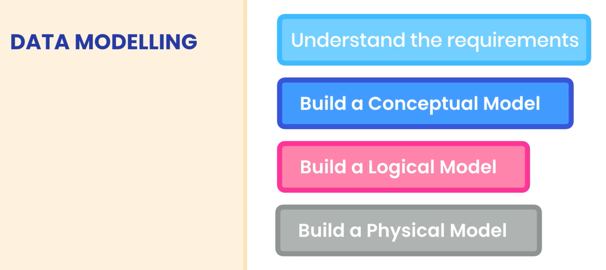
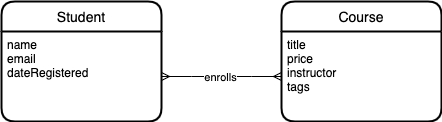
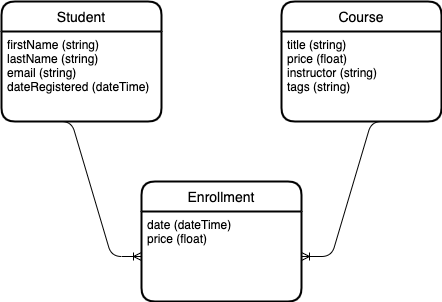

# Designing databases

## Introduction

This part walks you through a **step-by-step process** of creating and designing
a well-structured database. Remember that a well-structured database takes
planning before one can start coding up the database. A poorly designed database
causes problems down the line.

**Planning before coding is essential for a well-structured**.

## Data modelling

Data modelling is the process of creating a model for the data we want to store
in the database.

Note that the term "business" below may refer to the corporation, or the
business logic of the problem to solve.

It involves 4 steps:

1. **Understand and analyze the business requirements**. This should be done
   before creating tables in a database. The better you understand the problem
   to solve, the better solution! This may include looking at existing forms,
   spreadsheets, existing databases, etc... in order to map out the scope of the
   problem to solve.

2. **Build a conceptual model of the business**. Identify the entities and
   concepts, and their relationships. This is simply a visual representation of
   the relationships to present to the end users.

3. **Build a logical model of the business**. This is the data structure model
   for storing data in the database. This logical model must be independent of
   database technology. The logical model simply shows you the tables and
   columns you need.

4. **Build a physical model**. This is a refinement of the logical model above,
   custom fit to the database management system of your choice. This is the
   implementation of the logical model for a particular database technology. For
   instance, this model should have the exact data types supported by the
   database technology (`VARCHAR`, etc...), the default values for columns,
   whether a column is nullable, the primary keys, views, triggers, etc...

## Our example business logic

Let's say we want to build a website for selling online courses. People can sign
up and enroll in one or more courses. A course can have one or more tags, for
instance "frontend" or "backend".

## Conceptual models

Before creating the database, we need to figure out the conceptual model. The
conceptual model represents the entities and their relationships.

We should recognize some entities at once: `student` and `course`.

To visualize the relationships, there are two main ways to achieve this: (1)
Entity Relationship diagram (ER diagram), or (2) Unified Modeling Language
diagram (UML diagram).

ER diagrams are often used for data modelling.

There are various tools to create an ER diagram, the most popular being
[draw.io](https://app.diagrams.net/) and
[Lucidchart](https://www.lucidchart.com/pages/). This course uses draw.io.

Keep in mind that data modelling is an iterative process; you can't come up with
the perfect design on your first attempt.

In the conceptual model above, we do not care about the type of each attribute.
It is simply a conceptual model! We use it to communicate with the stakeholders,
to ensure we're both on the same page.

## Logical models

We'll now use the conceptual model from before, and refine it in order to make a
logical model. The logical model shall be independent of database technology.

Now, we need to specify the type of relationship between our entities.

### Types of relationships

We have different types of relationships:

1. **One-to-one**. Example: 1 student can enroll in 1 course. 1 course can only
   be taken by 1 student.

2. **One-to-many**. Example: 1 student can enroll in several courses. A course
   can only be taken by 1 student.

3. **Many-to-many**. Example: A student can enroll in several courses. A course
   can be taken by several students.

Others relationships are variations on the above-mentioned types.

What if we want to store the date that a student enrolled in a course. It is
neither an attribute of the student or the course. **It is an attribute of the
relationship; the enrollment**. If we meet such cases when modelling, we need to
create a new entity: `Enrollment`.

Note that the use of `string` as type for the `name` of a `Student` is
independent on the database technology. We do not declare `name` as `VARCHAR`,
but rather a language-agnostic type `string`.

Note the difference in relationship from the conceptual model to the logical
model. We had to add another entity in order to maintain the proper relationship
between entities.
