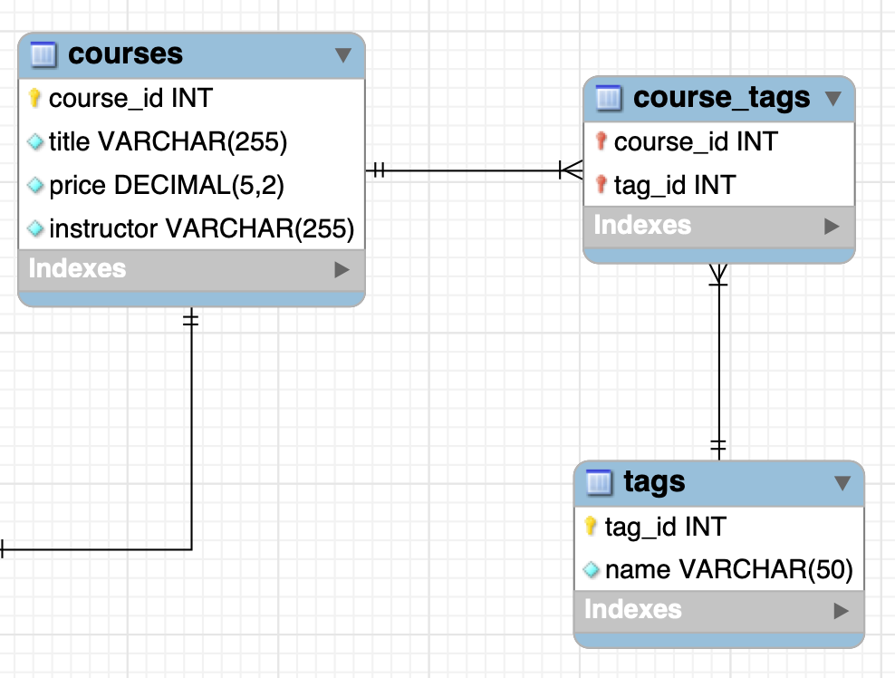

# Designing databases

## Introduction

This part walks you through a **step-by-step process** of creating and designing
a well-structured database. Remember that a well-structured database takes
planning before one can start coding up the database. A poorly designed database
causes problems down the line.

**Planning before coding is essential for a well-structured**.

## Data modelling

Data modelling is the process of creating a model for the data we want to store
in the database.

Note that the term "business" below may refer to the corporation, or the
business logic of the problem to solve.

It involves 4 steps:

1. **Understand and analyze the business requirements**. This should be done
   before creating tables in a database. The better you understand the problem
   to solve, the better solution! This may include looking at existing forms,
   spreadsheets, existing databases, etc... in order to map out the scope of the
   problem to solve.

2. **Build a conceptual model of the business**. Identify the entities and
   concepts, and their relationships. This is simply a visual representation of
   the relationships to present to the end users.

3. **Build a logical model of the business**. This is the data structure model
   for storing data in the database. This logical model must be independent of
   database technology. The logical model simply shows you the tables and
   columns you need.

4. **Build a physical model**. This is a refinement of the logical model above,
   custom fit to the database management system of your choice. This is the
   implementation of the logical model for a particular database technology. For
   instance, this model should have the exact data types supported by the
   database technology (`VARCHAR`, etc...), the default values for columns,
   whether a column is nullable, the primary keys, views, triggers, etc...

## Our example business logic

Let's say we want to build a website for selling online courses. People can sign
up and enroll in one or more courses. A course can have one or more tags, for
instance "frontend" or "backend".

## Conceptual models

Before creating the database, we need to figure out the conceptual model. The
conceptual model represents the entities and their relationships.

We should recognize some entities at once: `student` and `course`.

To visualize the relationships, there are two main ways to achieve this: (1)
Entity Relationship diagram (ER diagram), or (2) Unified Modeling Language
diagram (UML diagram).

ER diagrams are often used for data modelling.

There are various tools to create an ER diagram, the most popular being
[draw.io](https://app.diagrams.net/) and
[Lucidchart](https://www.lucidchart.com/pages/). This course uses draw.io.

Keep in mind that data modelling is an iterative process; you can't come up with
the perfect design on your first attempt.

In the conceptual model above, we do not care about the type of each attribute.
It is simply a conceptual model! We use it to communicate with the stakeholders,
to ensure we're both on the same page.

## Logical models

We'll now use the conceptual model from before, and refine it in order to make a
logical model. The logical model shall be independent of database technology.

Now, we need to specify the type of relationship between our entities.

### Types of relationships

We have different types of relationships:

1. **One-to-one**. Example: 1 student can enroll in 1 course. 1 course can only
   be taken by 1 student.

2. **One-to-many**. Example: 1 student can enroll in several courses. A course
   can only be taken by 1 student.

3. **Many-to-many**. Example: A student can enroll in several courses. A course
   can be taken by several students.

Others relationships are variations on the above-mentioned types.

What if we want to store the date that a student enrolled in a course. It is
neither an attribute of the student or the course. **It is an attribute of the
relationship; the enrollment**. If we meet such cases when modelling, we need to
create a new entity: `Enrollment`.

Note that the use of `string` as type for the `name` of a `Student` is
independent on the database technology. We do not declare `name` as `VARCHAR`,
but rather a language-agnostic type `string`.

Note the difference in relationship from the conceptual model to the logical
model. We had to add another entity in order to maintain the proper relationship
between entities.

Also note that keeping `tags` of type `string`, with a separator is not a good
idea for production. This is merely done to keep things a bit simple.

## Physical models

A physical model is the implementation of a logical model using a specific
database technology. This course uses MySQL.

Using MySQLWorkbench (`brew install mysqlworkbench` if it is not yet
downloaded), start by clicking `File -> New Model`. Rename the schema by
right-clicking the default `mydb` name, and click `Edit Schema...`. Click the
`Add diagram` under the `EER Diagram` section, in order to create an _Enhanced
Entity Relationship diagram_.

When naming tables, one can both use single or plural form of the word. In a
sense, a table is a container for each entity, and should therefore be plural.
On the other hand, you could say "A **student** has an id, etc...", which would
make the naming convention single. **If there is already a convention in-place,
don't break that convention!**

We populate the physical model, using the logical model as reference. This gives
us the following:

Note that we have not populated the tables with primary keys or their
relationships. This is a work in progress physical model.

## Primary keys

A primary key is a column that uniquely identifies each record in a given table.

If we were to give the `students` table a primary key of `email`, this would
**not** be a good idea. Given the relationship between a student and an
enrollment, this would mean repeating potentially very long strings in both
tables. Additionally, **a primary key should always remain the same!** A student
may change their email later. Thus, we add an ID column `student_id`. This kind
of column should be automatically incremented by MySQL.

We get the following physical model, still a work in progress:

What about `enrollments`? We'll look at that next.

## Foreign Keys

We have a one-to-many relationship between a student and an enrollment. We also
have a one-to-many relationship between a course and an enrollment.

When using a one-to-many relationship, the entity with the primary key is called
the parent table or the primary key table, and the entity without a primary is
called the child table or the foreign key table. In our case, the `students`
table is the parent table, and the `enrollments` table is the child table.

In MySQLWorkbench, a column is automatically added when implementing the
one-to-many relationship between two tables.

**A foreign key in one table is a column that references the primary key in
another table.**

In order to create the primary key for `enrollments`, we can use a composite
primary key. Another approach is to implement a primary key `enrollment_id` that
automatically increments, just like in `students` and `courses`.

By using a composite primary key, we prevent bad data from being inserted, e.g.
a student enrolling twice. However, if we later add another table that is a
child in a one-to-many relationship between it and `enrollments`, that new table
must also have the foreign keys `student_id` and `course_id`, just like
`enrollments` has.

This is not relevant for our case, and we can safely use a composite primary key
in the `enrollments` table. If we have this problem in the future, we can come
back and refactor the data model.

We now have the following physical model:

## Foreign Key Constraints

When a table has a foreign key, we need to constrain it in order to prevent
corrupted data.

We determine what should happen "On update" and "On delete" to a given table.

**We select `CASCADE` on update**. With this, MySQL automatically updates the
record in the child table if the primary key in the parent table changes.

If we use `RESTRICT`, then the update described above will be rejected.

If we use `SET NULL`, the foreign key will be set to null if the primary key in
the parent table changes. In this case, we end up with a child record (in
`enrollments`) that does not have a parent (in `students`). This is called an
orphan record. This is not desired to have in a database. Orphan records are bad
data; we don't know which student the enrollment is for.

We can also select `CASCADE` on delete. This means that an enrollment will
automatically be deleted if the student is deleted. However, choosing this
depends on the context. If we select this, then we won't be able to see which
courses were the most popular, historically.

In our example, we want MySQL to reject the delete operation.

This is necessary to do when we use foreign keys, in order to prevent bad and
corrupted data.

As a rule of thumb, we often want to `CASCADE` on update, but delete depends on
the context. Always check with the stakeholders what they want to do with the
data, and what consequences this has for deleting data.

## Normalization

We also need to make sure that our database handles redundancy and duplicate
entries. We don't want the size of the data in our database to grow
unnecessarily large.

Normalization is the process of reviewing our design, and ensuring that the
design follows some predefined rules that prevent data redundancy.

There exists the "7 normal forms", where each form assumes that the previous
form is in-place. For most applications, only the 3 first normal forms are
needed to apply to our design. The course focuses on these first 3 normal forms.

### First Normal Form (1NF)

**Each cell in a row should have a single value, and we cannot have repeated
columns**.

The `tags` column in our `courses` table imply that we're going to have multiple
values in a single cell, separated using a separator (e.g. `,`). We also don't
know how many tags a course is going to have ahead of time, so we cannot create
columns for `tag1`, `tag2`, etc... This approach is not scalable.

To solve this problem, we need to extract the `tags` column out of the `courses`
table and treat it as its own table called `tags`. Then we'll add a many-to-many
relationship between `courses` and `tags`.

We will soon see how the relationship between `courses` and `tags` ends up being
implemented.

#### Link Tables

We now need to add the many-to-many relationship between `courses` and `tags`.
However, relational databases do not have many-to-many relationships, strictly
speaking. If they do, they hide some implementation details in order to help
developer workflow.

We need to add a **link table** to achieve a many-to-many relationship between
the two tables. In practice, we end up with the same relationship as `students`,
`enrollments` and `courses` follow; we get 2 one-to-many relationships, both
`students` and `courses` being the parent table.

We create a new table in order to achieve the many-to-many relationship between
`courses` and `tags`, and we call this table `course_tags`. We also remove the
`tags` attribute in the `courses` table. We get the following one-to-many
relationships:

### Second Normal Form (2NF)

To qualify for second normal form, a relation must:

1. Be in the first normal form (1NF)

2. Not have any non-prime attribute that is dependent on any proper subset of
   any candidate key of the relation. A non-prime attribute of a relation is an
   attribute that is not a part of any candidate key of the relation.

That's some heavy stuff. Let's make it very simple:

**We assume the relation is in the first normal form. Additionally, every table
should describe exactly one entity, and every column in that table should
describe that entity**.

Let's look at an example. Our `courses` table has the following attributes:
`title`, `price`, `instructor`. It stores course records. We do not have a
column for `enrollment_date`, as this column does not describe the entity
`course`. Rather, `enrollment_date` describes the entity `enrollment`.

Let's look at another example. We have the following table `orders`:

This relationship is not in the second normal form. The purpose of the entity
`orders` is to store orders, not a customer's name! The `customer_name` should
be refactored into its own table: `customers`. We get the following:

This is very inline with the concept that **primary keys should not be
updated**.

In our original example, the `courses` table violates the second normal form. An
`instructor` should not really be a `VARCHAR` and belong to `courses` - one
instructor may have several courses, and this would cause duplication in our
database!

We add a new table `instructors`, and declare that a one-to-many relationship
between `instructors` and `courses`. We get the following physical model:

### Third Normal Form (3NF)

To qualify for third normal form, a relation must:

1. Be in the second normal form (2NF). This implies in turn the that relation is
   in the first normal form (1NF).

2. All the attributes in a table are determined only by the candidate keys of
   that relation, and not by the non-prim attributes.

Again, that's quite heavy. Let's explain it using a simple example:

We assume the relation is in the second normal form and, as an implication, in
the first normal form. We have a table `invoices` with the following columns:

We can calculate the `balance` column by subtracting `invoice_total` and
`payment_total`; **`balance = invoice_total - payment_total`**.

We say that `balance` is dependent on, or **derives from**, the `invoice_total`
and `payment_total` columns, which means that if the value of `invoice_total` or
`payment_total` changes, the value of `balance` must be recalculated. Thus, we
should not have a column `balance` in the `invoices` table.

In summary: **A column in a table should not be derived from other columns in
that table**. This helps us reduce duplication and maintain data integrity.

The same goes for a table having the columns `first_name`, `last_name` and
`full_name`. We can always derive `full_name` from `first_name` and `last_name`.
Thus, we should not have a column `full_name` in our table.

### A pragmatic advice on normalization

Don't worry about memorizing the normalization forms unless you're preparing for
an exam.

Simply focus on reducing redundancy.

Don't jump into creating tables. You almost always end up with a messy design if
you don't think the conceptual model, then the logical model, and then the
physical model through.

Always think about the requirements. If we have `customers` with multiple
shipping addresses, we should separate this into its own table `address`. If
this is not a requirement, there may be no need to separate this data.

## Don't model the universe!
