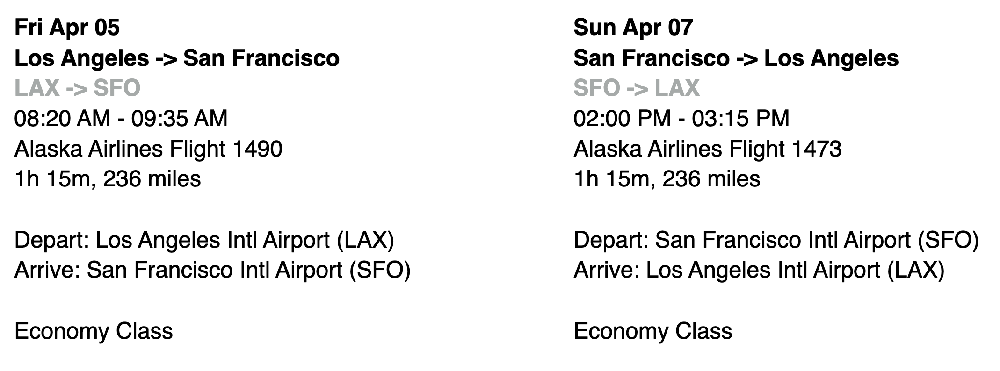
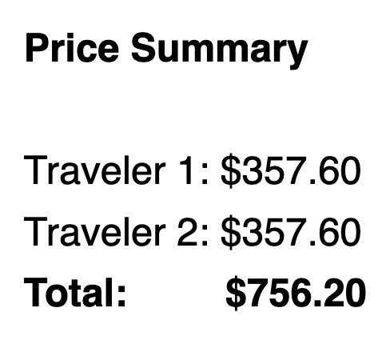

# Project: Flight Booking System

## Description

This is a project about designing the conceptual model, the logical model, the
physical model, and finally the database for a flight booking system.

A sample ticket can be found below, and should be sufficient for modeling the
data in the database.

## Sample Ticket

  
