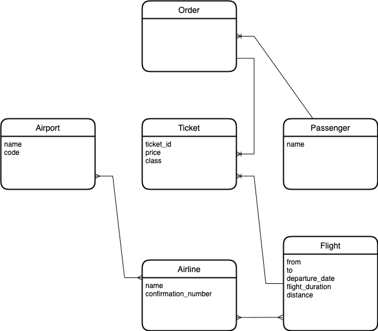
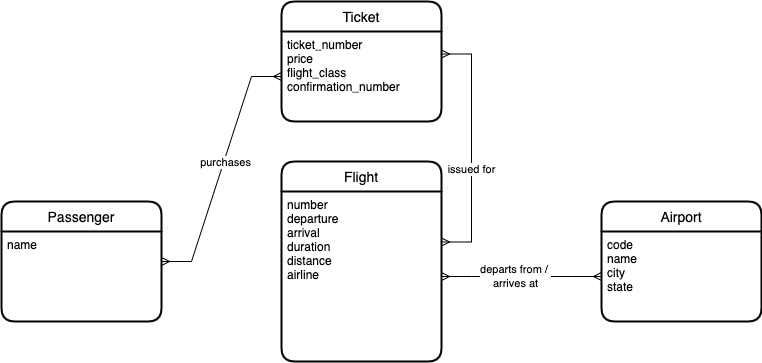
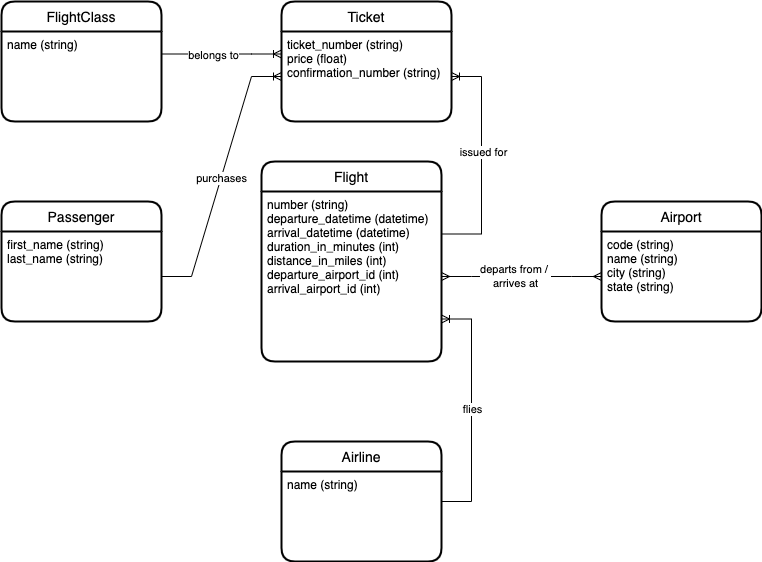
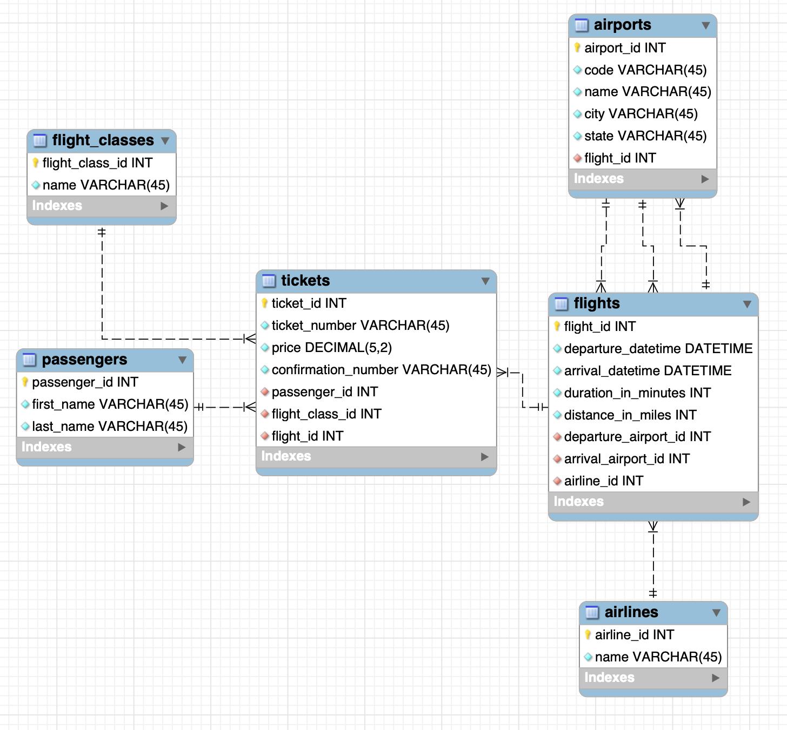

# Project: Flight Booking System

## Description

This is a project about designing the conceptual model, the logical model, the
physical model, and finally the database for a flight booking system.

A sample ticket can be found below, and should be sufficient for modeling the
data in the database.

## Sample Ticket

 

## Conceptual Model

I created the following conceptual model:

After watching the solution by Mosh, we get the following conceptual model:

Note that the relationships are all many-to-many, just for simplicity. We could
have made the lines straight, without any relationship and just have them be
written out like in the figure above.

### Conceptual Model: What did I get wrong?

I kind of jumped straight to the logical model. I made the relationships too
detailed. I also added more entities than what was conceptually present in the
problem statement.

### Conceptual Model: What did I get right?

Many of the entities with corresponding attributes were correct.

## Logical Model

My initial conceptual model is more like a logical model:

The figure below is Mosh' logical model.

### Logical Model: What did I get wrong?

I at least over-engineered the solution with a ticket. I started thinking that
one person could order a flight for several people, and that this must be
accounted for.

I also notice a pattern that if you have something like an enum, e.g.
`FlightClass`, this should often be extracted as its own entity, not kept as a
`string` for instance.

Mosh also fixed some relationships between entities.

Another very important thing: Shouldn't we normalize the data in the `Airport`
entity? Concretely, shouldn't we have a `Country` with many `State` entities,
and each `State` entity have many `City` entities. The answer is **no**.
Oftentimes, we need to join this kind of data together. If we normalize it, it
can affect the performance of our queries. **By de-normalizing the data, we
increase the performance**. This should only be done when we know that we have
data that would be frequently joined together, if we had normalized it.

## Physical Model

This is left as a task for me, so I don't have the "solution" by Mosh. This is
what I came up with for the physical model.

The relationship between `airports` and `flights` are a bit messy. The intention
is that a `flight` is related to exactly two `airport` entities. An `airport`
can have several flights.

## Database

Creating the database is simply `Database -> Forward Engineering` in
MySQLWorkbench.
