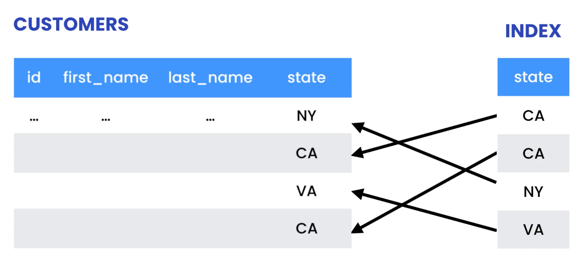
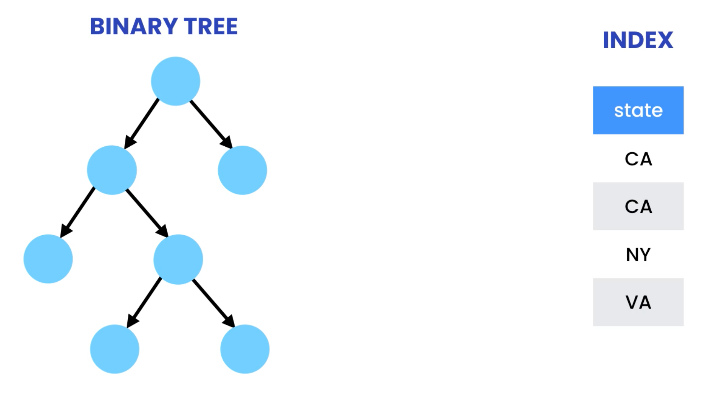
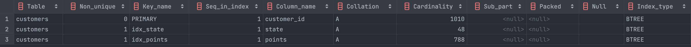
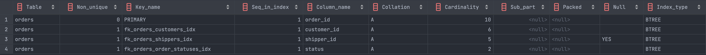

# Indexing for high performance

## Indexes

Indexes are data structures that database engines use to find data quickly. As
an analogy, think of a telephone registry.

Let's say we want to find customers that live in California. As the number of
records in a table grow, the cost of this operation increases drastically.

We speed up the query by creating an index on the `state` column. This is like
creating a collection of customers, sorted by their state.

This index only has a reference to the actual customers table.



This is way faster than reading every single record.

In many cases, indexes are small enough that they can fit into memory, rather
than live on disk. That is why it is much faster to use them to find data.


### Cost of indexes

- **Increase the size of database**, because they need to be permanently store
  next to our tables.
- **Slow down the write operations**, because we need consistent state across
  tables and indexes when writing to the database.

**Because of this, we should reserve indexes for performance critical queries.**

**Design indexes based on your queries, not your tables.** The whole point of
using an index is to speed up a slow query.

### Implementation detail

Internally, indexes are often stored as binary trees. In the TDT4145 course, we
use B+ trees.



## Creating indexes

```sql
EXPLAIN SELECT customer_id
FROM customers c
WHERE state = 'CA'
```

Using the `EXPLAIN` keyword, MySQL explains the executed query.

We see that the `type=ALL` and the total amount of rows (1010). This `SELECT`
query looks through all rows in the `customers` table.

Now, we create an index on the `state` column.

```sql
CREATE INDEX idx_state ON customers (state);
```

When executing the `SELECT` query above, we see something else. We see that the
`type=ref`, `possible_keys=idx_state`, `key=idx_state`. The amount of rows is
now 112. That means we decreased the amount of rows to search through by a
factor of 10!

**This means that by creating the `idx_state`, a query using
`WHERE state='something'` internally uses the newly created index**.

### Exercise: Creating indexes

_Write a query to find customers with more than 1000 points. Use `EXPLAIN` to
see the difference before and after creating the index._

```sql
EXPLAIN
SELECT customer_id
FROM customers
WHERE points > 1000;
```

This searches through all rows.

```sql
CREATE INDEX idx_points ON customers (points);
```

Running the `SELECT` query again, we get `type=range`, `key=idx_points`,
`rows=529`.

## Viewing indexes

```sql
SHOW INDEXES IN customers;
```



We see the primary key is an auto-generated index, such that we can quickly look
up records on their index. **This is also called a clustered index**.

Collation represents how data is sorted in the index. `A` means ascending. `B`
means descending.

Cardinality represents an estimated number of unique values in the index. The
cardinality of the primary key naturally equals the number of records in the
table. **Note that this is an estimate**.

To get a more specific number of records, we use `ANALYZE`, followed by
`SHOW INDEXES`.

```sql
-- Updates the state of customers
ANALYZE TABLE customers;

-- This will now display more correct information
SHOW INDEXES IN customers;
```

The other indexes in the table, `idx_state` and `idx_points` are called
**secondary indexes**.

For any secondary index, the primary key is included **in order to reference
back to the correct record in the table**. For instance, for a given amount of
points, we need to be able to trace back the ID that the points belong to.

The index type for all these indexes are `BTREE`, short for binary tree. Again,
note that in the TDT4145 course, we use B+ trees.

### Indexes and foreign keys

Now let's look at the indexes in the `orders` table.

```sql
SHOW INDEXES IN orders;
```



We also have secondary indexes that are placed on the **foreign key columns**.
MySQL automatically adds indexes to the foreign key columns.

## Prefix indexes
