# Transactions, concurrency & deadlocks

## Transactions

**A transaction is a group of SQL statements that represent a single unit of
work**. All the steps in a transaction should be completed successfully, or the
transaction will fail.

For instance, think of a bank transaction. You withdraw some money, and deposit
some money into another account. If either one of these fails, the transaction
should not be completed.

Another example would be tables with columns that are **foreign keys** to other
columns. If we want to create a new entry in the `orders` table, the correct
data in should also be entered in the `order_items` table. One should not
succeed whilst the other one fails. Hence, we group these in a transaction to
ensure that all operations succeed or fail.

### ACID properties

1. **Atomicity**. Our transactions are like atoms; they are unbreakable. Each
   transaction is a single unit of work, no matter how many statements it
   contains. Either all statements are executed successfully, and the
   transaction is committed, or no statement is executed.

2. **Consistency**. With these transactions, our database always remains in a
   consistent state. We won't end up with an `order` without a corresponding
   `order_item`.

3. **Isolation**. The transactions are isolated from each other if they try to
   modify the same data. They cannot interfere with each other. If multiple
   transactions try to update the same data, the affected rows get locked so
   that only one transaction at a time can update the data.

4. **Durability**. Once a transaction is committed, the changes made by the
   transaction are permanent.

## Creating transactions

### With `COMMIT`

```sql
START TRANSACTION;

INSERT INTO orders(customer_id, order_date, status)
VALUES (1, '2019-01-01', 1);

INSERT INTO order_items
VALUES (LAST_INSERT_ID(), 1, 1, 1);

COMMIT;
```

### With `ROLLBACK`

There are cases where we want to do manual error checking. This is when we end
the transaction with `ROLLBACK`, as opposed to `COMMIT`.

```sql
START TRANSACTION;

INSERT INTO orders(customer_id, order_date, status)
VALUES (1, '2019-01-01', 1);

INSERT INTO order_items
VALUES (LAST_INSERT_ID(), 1, 1, 1);

ROLLBACK;
```

This will roll back the transaction, and undo all the changes.

### All commands are wrapped in transactions

MySQL wraps all single operations in a transaction, and commits the executed
code if the status code is not an error. This means that a simple `INSERT`,
`UPDATE`, `DELETE`, etc..., are really wrapped in transactions.

```sql
SHOW VARIABLES LIKE 'autocommit' -- This will have the value ON by default
```

## Concurrency and locking

We'll simulate 2 users trying to update the points of a given customer at the
same time. Using the application for managing the database, we open 2 sessions
(in IntelliJ, this is 2 instances of the query console).

We're going to execute the following transaction:

```sql
START TRANSACTION;

UPDATE customers
SET points = points + 10
WHERE customer_id = 1;

COMMIT;
```

In the first session, we start the transaction and update the customer, but we
do not commit.

In the second session, we start the transaction and update the customer, **but
we see a loading spinner**. This is because the first session has not yet
committed.

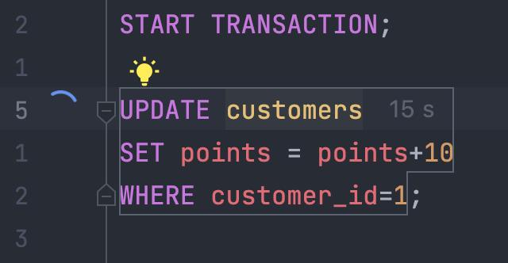

Now, we redo the transaction in the first session without commiting. Then we
start the transaction in the second session and update the customer. The same
thing happens; we get the loading spinner. Then we go back in the first session
and commit. Back to the second session, this transaction has now also resolved
itself.

The end result is that the customer with ID equal to 1 now has 20 more points,
executed using 2 transactions.

## Concurrency problems

### Lost updates

This happens when two transactions try to update the same data, and we don't use
locks.

For instance, we have two transactions that try to update the same customer.
Transaction A tries to update the `state`, and transaction B tries to update the
`points`.

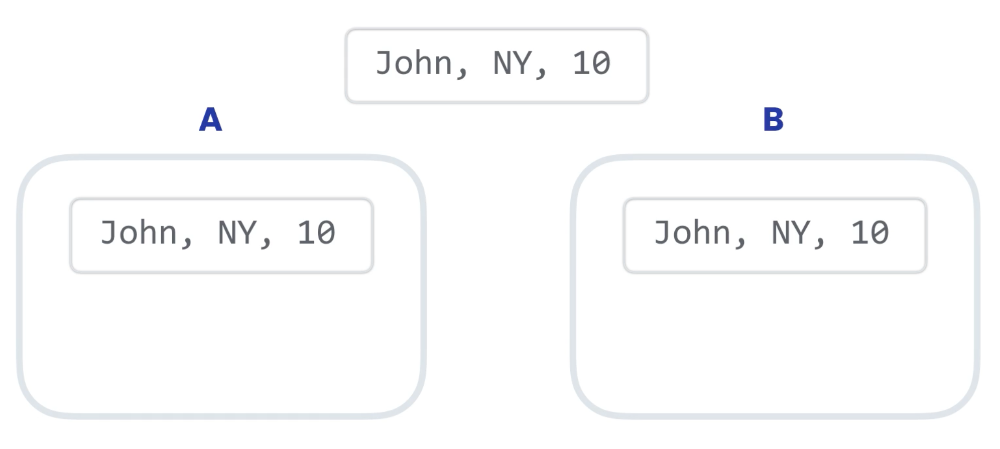

Transaction A updates state, but has not committed yet. **At the same time**,
transaction B updates the points.

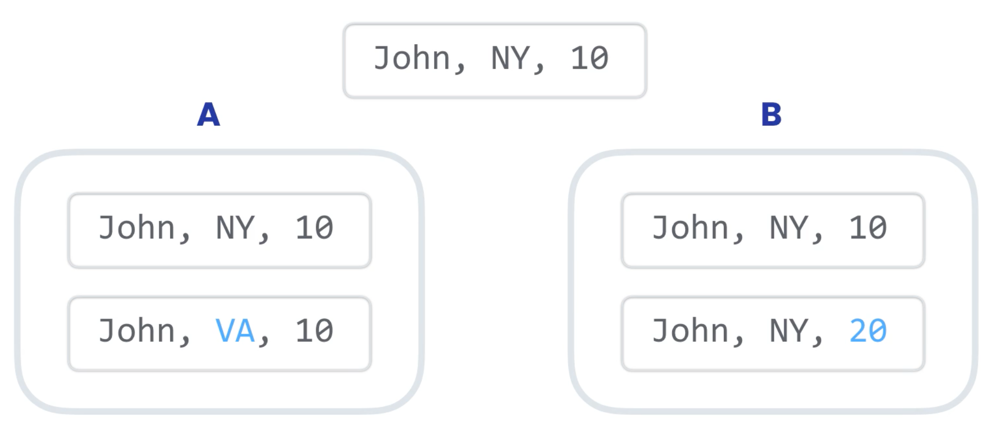

**The transaction that commits last will overwrite the previously committed
transaction**. We use locks to prevent this from happening, and to ensure
consistent data.

### Dirty reads

A dirty read happens when a transaction reads data that has not yet been
committed.

For instance, transaction A changes `points`. Before transaction A commits,
transaction B reads the value of `points`.

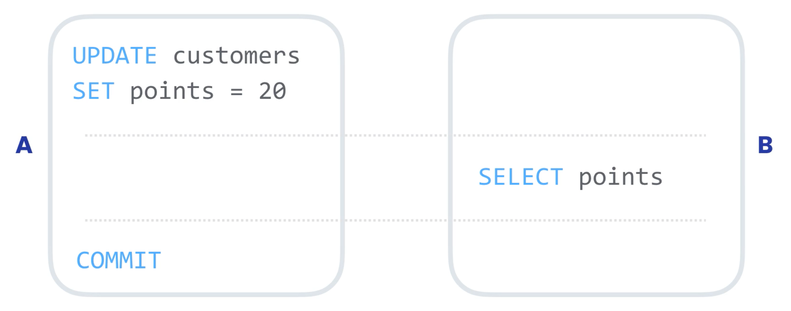

What if transaction A rolls back (using `ROLLBACK`) before transaction B
completes? Transaction B would still use the `points = 20`, and could
potentially **take wrong decisions based on data that never really was committed
to the database**.

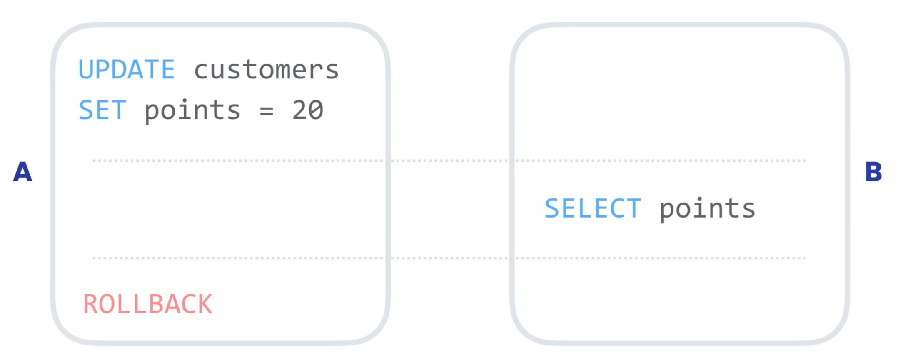

SQL provides isolation levels for transactional data. `READ COMMITTED` ensures
that a transaction can only read committed data. This prevents dirty reads.

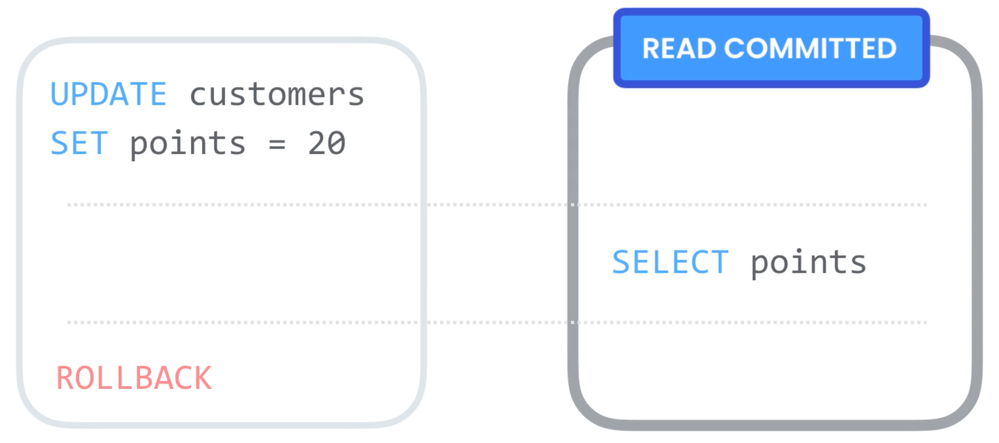

### Non-repeatable reads

When adding more isolation to a transaction, we can guarantee that a transaction
can only interact with committed data.

**What if - during the course of a transaction - we read something twice, and
get different results?**

For instance, transaction A selects `points` with the value 10 and makes a
business decision based on this value. Before transaction A completes,
transaction B updates `points` with the value 0. Back to transaction A, it reads
`points` again, perhaps as a sub query.

Transaction A reads `points` twice, and it has a different value each time. This
is a **non-repeatable or inconsistent read**.

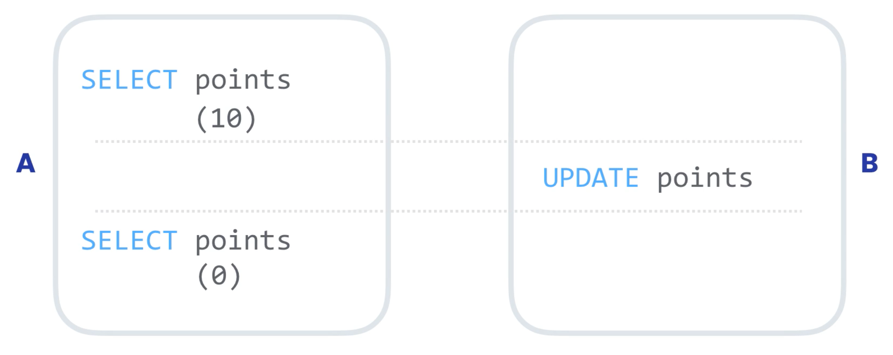

In transaction A, if we read that `points=10`, we need to make a decision based
on this. Thus, the next time we read `points`, it should have the same value.
**We need to increase the isolation level of transaction A**. We add
`REPEATABLE READ` to this transaction.

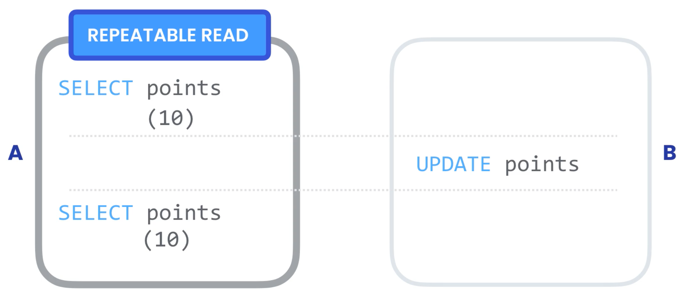

### Phantom reads

Image a transaction A. We're querying all customers with more than 10 points. At
the same time, transaction B updates the points of a customer **that was not
originally in the records that transaction A read**. This customer from
transaction B might be eligible to join the records in transaction A, but it was
not discovered by transaction A.

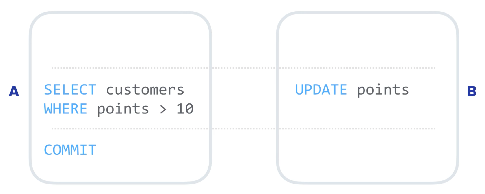

**We need to make sure that no other transaction are running that can impact our
query**. For this, we have the isolation level `SERIALIZABLE`. If there are
other transactions modifying the data that can impact the query result, our
transaction has to wait for them to commit the changes.

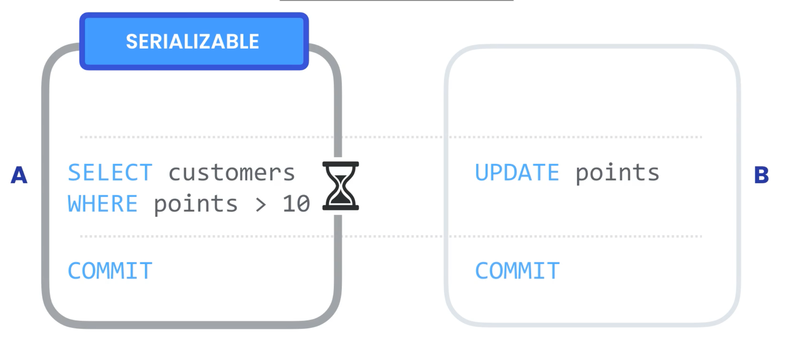

In essence, these are executed sequentially. **This comes at a cost. The more
users and concurrent transaction we have, we experience more waiting and the
system slows down.**

## Transaction isolation levels

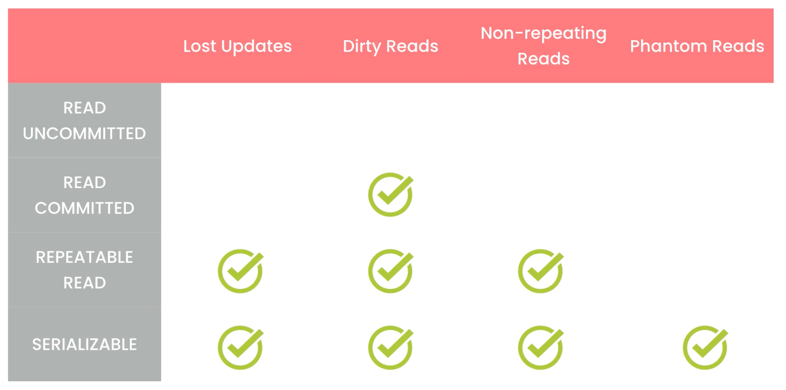

**The more we increase the isolation level, the more performance and scalability
is lost**.

In MySQL, the default transaction isolation level is **repeatable read**. This
works well for most scenarios.

### Setting isolation level

```sql
-- This is 'REPEATABLE-READ' by default
SHOW VARIABLES LIKE 'transaction_isolation';

-- This sets the isolation level to SERIALIZABLE for the next transaction
SET TRANSACTION ISOLATION LEVEL SERIALIZABLE;

-- This sets the isolation level to SERIALIZABLE for all future transactions
-- in the current session
SET SESSION TRANSACTION ISOLATION LEVEL SERIALIZABLE;

-- This sets the isolation level to SERIALIZABLE for all future transactions
-- in all sessions
SET GLOBAL TRANSACTION ISOLATION LEVEL SERIALIZABLE;
```

## Deadlocks

A deadlock happens when different transaction cannot complete because each
transaction hold a lock that the other transaction needs in order to complete.
Both transactions wait for each other, and wait for each other.

If you're an application developer, you should write the interaction with the
database in such a way that it can re-issue a transaction if a deadlock occurs.

### Minimizing deadlocks

- **When updating multiple records across several sessions, follow the same
  order of updating**.

- **Keep transactions short in duration and small**. This minimizes the chance
  of a transaction colliding with another transaction.
