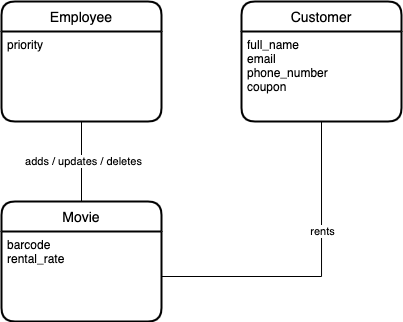
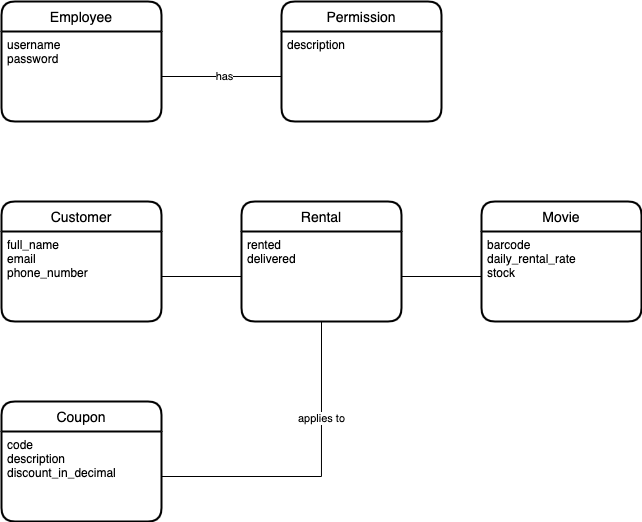
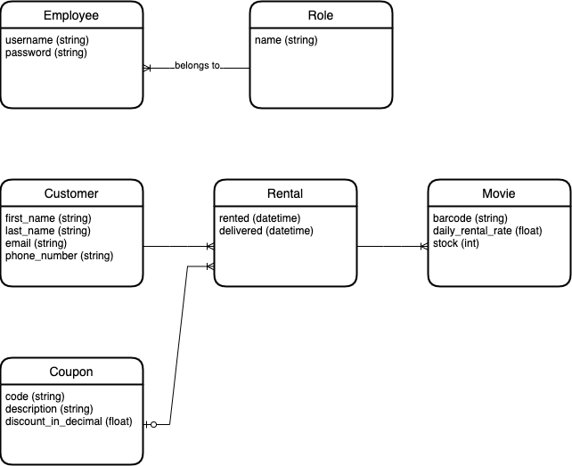
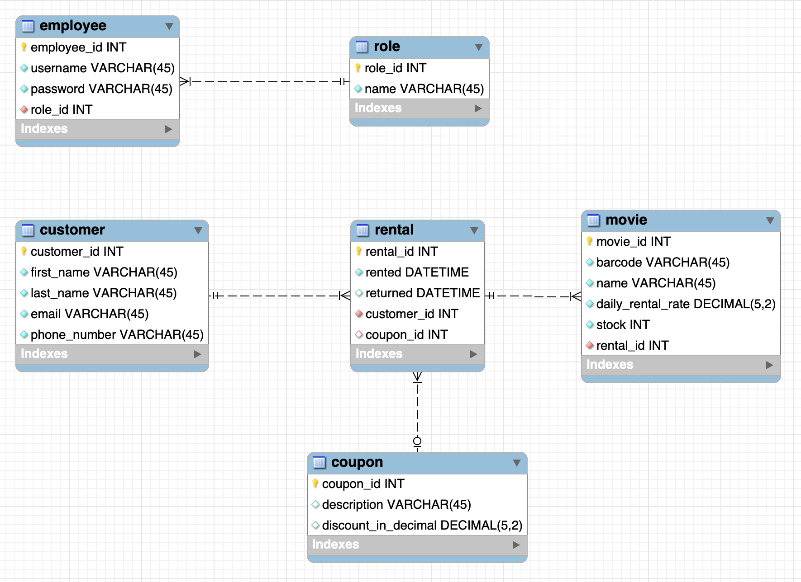

# Project: Video Rental Application

## Description

This is a project about designing the conceptual model, the logical model, the
physical model, and finally the database for a video rental application.

Requirements can be found below, and should be sufficient for modeling the data
in the database.

## Requirements

We’re going to build a desktop application called Vidly. This application will
be used at a video rental store. We need different levels of permissions for
different users.

The store manager should be able to add/update/delete the list of movies. They
will be in charge of setting the stock for each movie as well as the daily
rental rate. Cashiers should have a read-only view of the list of movies. They
should be able to manage the list of customers and the movies they rent.

At check out, a customer brings one or more movies. The cashier looks up a
customer by their phone number. If the customer is a first-time customer, the
cashier asks their full name, email and phone number, and then registers them in
the system. The cashier then scans the movies the customer has brought to check
out and records them in the system. Each movie has a 10 digit barcode printed on
the cover.

When the customer returns to the store, they’ll bring the movies they rented. If
a movie is lost, the customer should be charged 5 times the daily rental rate of
the movie. The cashier should mark the movie as lost and this will reduce the
stock. There is no need to keep track of the lost movies. All we need to know is
the the number of movies in stock and how much the customer was charged.

For other movies, the customer should be charged based on the number of days and
the daily rental rate.

We issue discount coupons from time to time. The customer can bring a coupon
when returning the movies.

It is possible that a customer returns the movies they’ve rented in multiple
visits.

We need to be able to track the:

- Top movies
- Top customers
- Revenue per day, month and year

## Conceptual Model

This time, I tried to really abstract things away. I am fully aware that some of
these relationships should be refactored to separate entities, but I really just
tried to mimic the requirements in a visual way.

This is my result:

### Conceptual Model: Solution

We can see here that I went a bit overboard with the abstraction. This time,
Mosh introduced the link table `Rental` to describe the relationship between
`Customer`, `Rental` and `Movie`. We went quite in-depth on the `Employee` and
`Permission` too, assuming some attributes (e.g. `username`, `password`) about
the entity.

## Logical model

This was almost simply adding types to attributes. Note the logical many-to-many
relationship between an `Employee` and a `Permission` in the conceptual model
above. This is strictly speaking a too fine-grained implementation. Nowhere in
the requirements is it stated that we need that amount of control over the
permissions of our employees. We can simply assign a `Role` to an `Employee`.
This way, every time we get a new cashier, this cashier gets the same
permissions as an existing cashier.

Additionally, note the "1 Optional to Many Mandatory" relationship between
`Coupon` and `Rental`. When creating the physical model, this means that
`Rental` will have a column `coupon_id` (or something like that), that can be
null. In other words, it is not required for a `Rental` to have an associated
`Coupon`.

We get the following logical model:

## Physical model

We get the following physical model:

Note that `rental` has a foreign key `coupon_id` which can be null! This is
because of the "1 Optional to Many Mandatory" relationship in our logical model.
